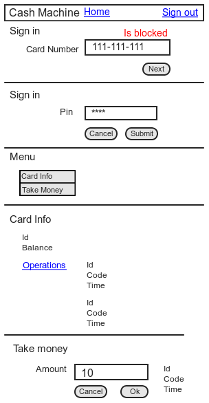

# Cash Machine

## What is cash machine ?
In our days there a lot of javascript client and backend side frameworks. But for best understanding we should do practice, so I created repo to write there the same app "cash machine" using different frameworks.  
The app has two sides back and client. On back there is api and on client there is ui.  
It's something similar to [TodoMVC](https://github.com/tastejs/todomvc)

## Apps

### Client
* [React + Flux](https://github.com/ButuzGOL/cashmachine/tree/master/apps/react)
* [Angular](https://github.com/ButuzGOL/cashmachine/tree/master/apps/angular)
* [Ember](https://github.com/ButuzGOL/cashmachine/tree/master/apps/ember)
* [Marionette](https://github.com/ButuzGOL/cashmachine/tree/master/apps/marionette)  

### Backend
* [Sails](https://github.com/ButuzGOL/cashmachine/tree/master/apps/sails)

### Labs
* [Express + Chaplin](https://github.com/ButuzGOL/cashmachine/tree/master/apps/labs/express-chaplin)

## Mockup
# 
